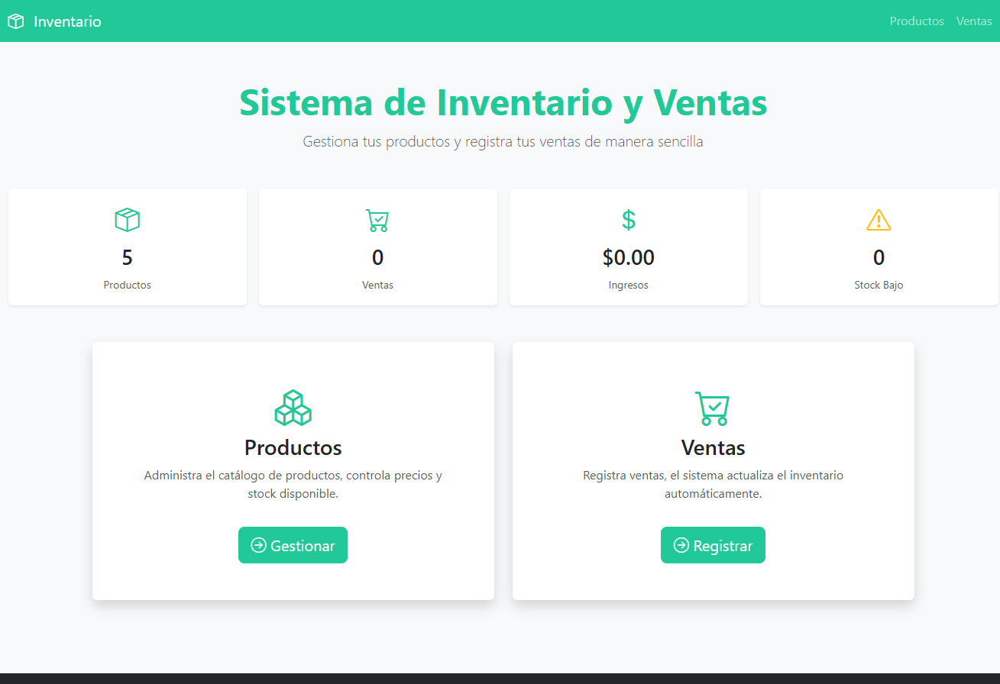
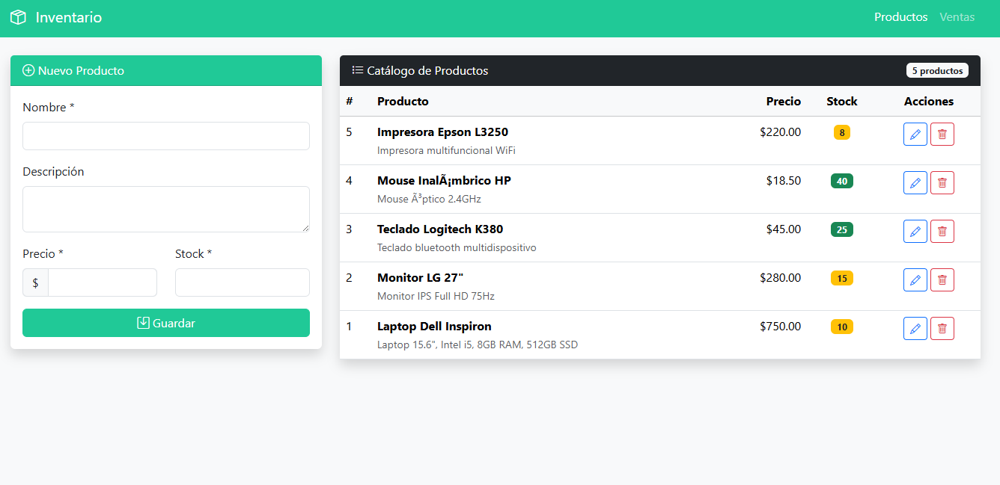
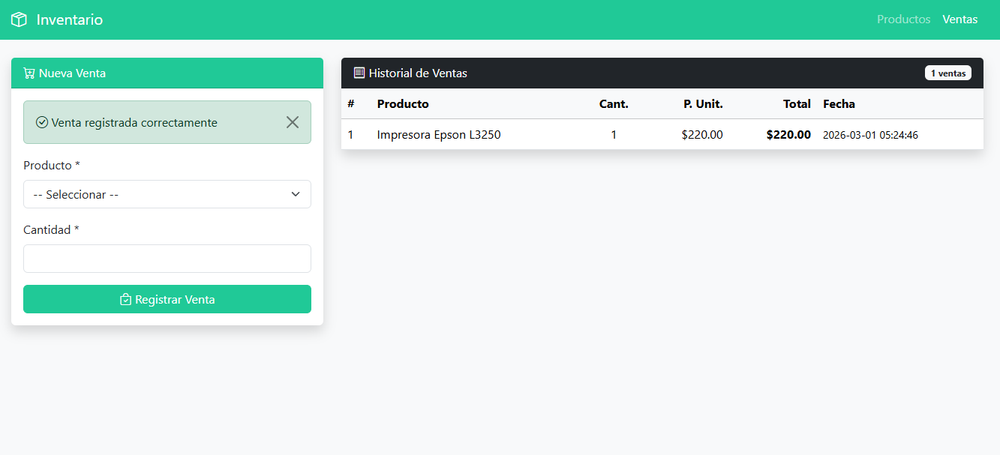

# Inventario y Ventas

Aplicación web para control de inventario y registro de ventas.

## Tecnologías

- PHP 7.4+
- MySQL 5.7+
- Bootstrap 5.3.2

## Requisitos

- PHP 7.4 o superior
- MySQL 5.7 o superior
- Servidor web (XAMPP, WAMP, LAMP)

## Instalación

1. Clonar repositorio:
```bash
git clone https://github.com/victorsolisg/actividad-integradora-inventario.git
```

2. Copiar a carpeta del servidor:
```bash
# XAMPP: C:/xampp/htdocs/inventario
# WAMP: C:/wamp64/www/inventario
```

3. Importar base de datos:
```bash
mysql -u root -p < database/inventario.sql
```

4. Configurar conexión en `config/database.php`

5. Acceder: `http://localhost/inventario/public/`

## Estructura

```
├── config/database.php
├── models/
│   ├── Producto.php
│   └── Venta.php
├── controllers/
│   ├── ProductoController.php
│   └── VentaController.php
├── services/VentaService.php
├── public/
│   ├── index.php
│   ├── productos.php
│   └── ventas.php
└── database/inventario.sql
```

## Funcionalidades

### Productos
- Crear, listar, editar y eliminar productos
- Validación de datos

### Ventas
- Registro de ventas
- Control de stock automático
- Historial de ventas

## Validaciones

### Productos
- Nombre obligatorio (mínimo 2 caracteres)
- Precio debe ser mayor a cero
- Stock no puede ser negativo

### Ventas
- Producto requerido
- Cantidad mayor a cero
- Validación de stock disponible

## Capturas

### Inicio


### Productos


### Ventas

